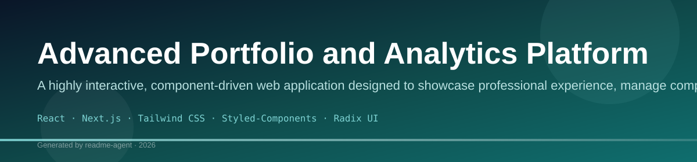
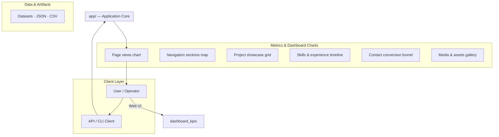
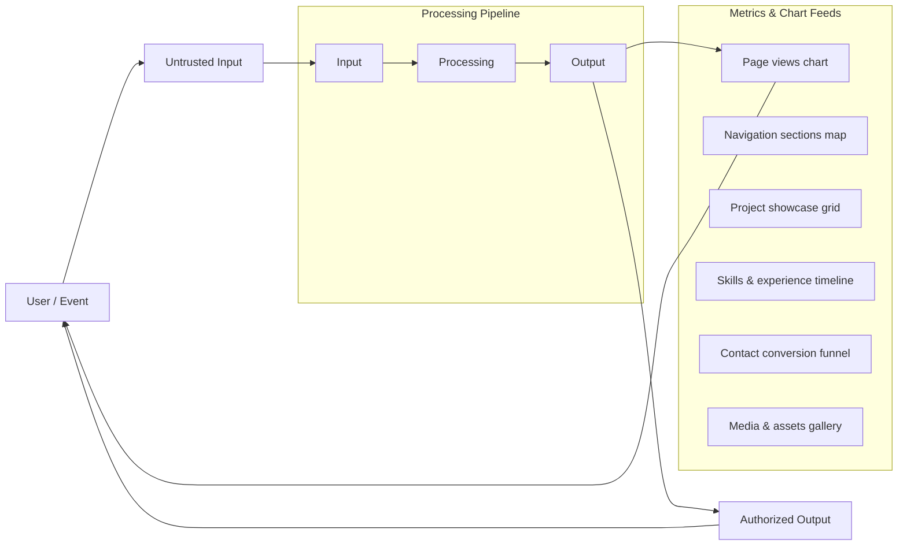
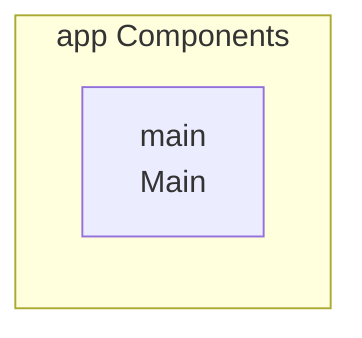
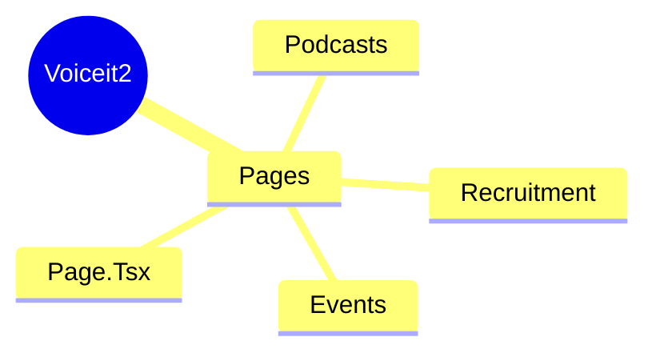
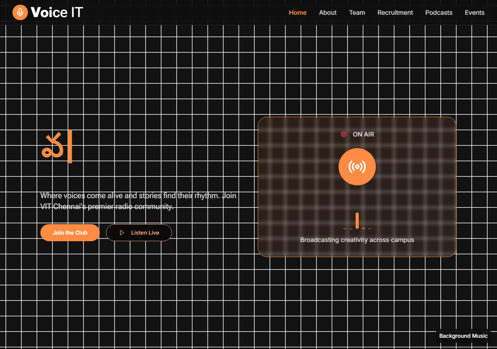
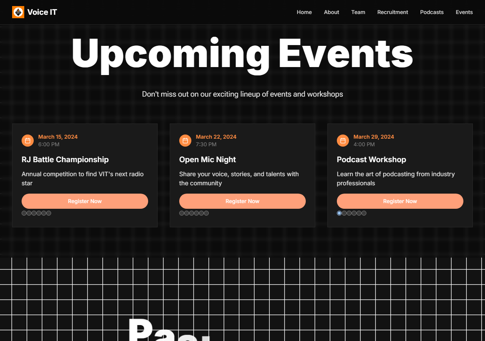
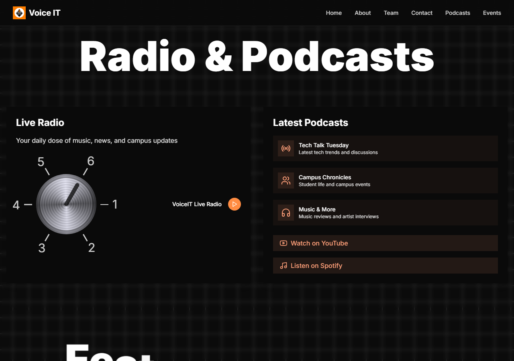
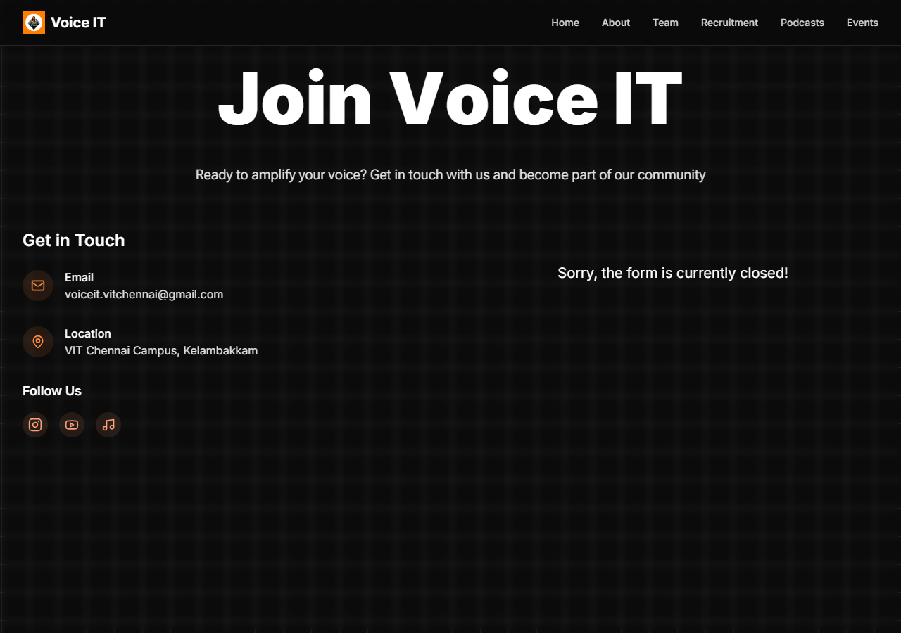

# Project Title (Placeholder)

This repository is currently undergoing a name change or merge, as evidenced by conflict markers in the documentation. Please refer to the project team for the definitive name and scope.

## Overview

The repository appears to be undergoing a name change or merge. No functional overview can be provided based on the current content.

## Installation

Not available in repository

## Usage

Not available in repository

## Contributing

We welcome contributions! Please read our Contributing Guidelines for more information.

## License

Not available in repository

## Setup Guide

### Frontend Setup

```bash

npm install
npm run dev     # development
npm run build && npm start   # production
```

Open `http://127.0.0.1:3000` (or the port shown in the terminal).

### Running the Application

1. **Start web app** — `npm run dev` in `./`

```bash
cd .
npm install
npm run dev
```

## System Architecture

High-level system design, data flows, API map, and workflow pipelines derived from the repository structure.

### System Architecture



### Data Flow & Charts Pipeline



### Component & API Map



### Application Page Map



## Screenshots & Assets


## Application Pages

Screenshots captured from the running application. Each page is listed with its function.

#### Background Music

Application page at `/`



#### Events

Application page at `/events`



#### Podcasts

Application page at `/podcasts`



#### Recruitment

Application page at `/recruitment`


